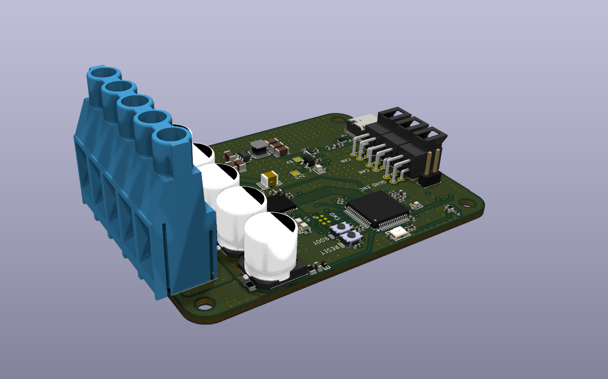
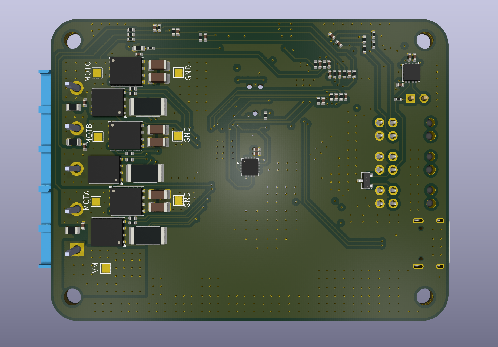

# STM32G474 Brushless Motor Controller

An open-source three-phase BLDC/PMSM motor controller built around the STM32G474 and the TI DRV8353S gate driver. Designed for field-oriented control (FOC) with absolute position feedback, low-side current sensing, and a wide input range.

---

## Hardware

<p align="center">
  
  
</p>

---

## Overview

A compact 4-layer ESC-class controller for robotics, gimbal, and general BLDC/PMSM drives. It pairs an STM32G474 (developed on the Nucleo-G474) with a DRV8353S gate driver and six MOSFETs in a standard three-phase half-bridge.

### Specifications

| Parameter | Value |
|---|---|
| Controller | STM32G474 (Nucleo-G474) |
| Gate driver | DRV8353S (SPI variant) |
| Input voltage | 12 to 60 V |
| Max continuous phase current | 25 A |
| Power MOSFETs | IAUCN08S7N019ATMA1 (80 V, 1.9 mΩ) |
| Switching frequency | 20 kHz |
| Position sensor | MagAlpha MA730 (SPI) + external quadrature backup |
| Current sensing | Low-side, 2 mΩ shunts, Kelvin sense |
| Logic supply | LMR51635 (5 V) into AP2112K-3.3 LDO (3.3 V) |
| Board | 57 x 75 mm, 4-layer |
| License | MIT |

---

## Power Stage

### MOSFETs

Six **IAUCN08S7N019ATMA1** N-channel MOSFETs (80 V, 1.9 mΩ) form three half-bridges.

**Voltage margin:** A 60 V max bus on an 80 V FET leaves 20 V (25%) of margin for switching overshoot and regen transients. This is a deliberate, conservative choice.

**Conduction loss per FET:**

```
P_cond = I² × R_DS(on) = 25² × 0.0019 ≈ 1.19 W
```

This dominates the loss budget at 20 kHz. Generous copper and thermal vias under each FET keep junction temperatures in check.

### Gate Charge and Switching Times

Key dynamic figures from the datasheet:

| Parameter | Symbol | Typ |
|---|---|---|
| Total gate charge | Q_g | 63 nC |
| Gate-to-drain (Miller) charge | Q_gd | 12 nC |
| Output capacitance | C_oss | 1756 pF |
| Rise / fall time | t_r / t_f | 15 / 18 ns |

The switching speed on this board is set by the DRV8353 drive current (500 mA source / 1000 mA sink) and the 10 Ω gate resistor, not by the datasheet test condition. The voltage transition time is set by how fast the Miller charge moves:

```
t_on  ≈ Q_gd / I_source = 12 nC / 0.5 A = 24 ns
t_off ≈ Q_gd / I_sink   = 12 nC / 1.0 A = 12 ns
```

Slower turn-on tames overshoot and dV/dt; faster turn-off keeps shoot-through risk low.

### Switching Loss

Switching loss scales linearly with frequency:

```
P_sw   = ½ × V_bus × I_phase × (t_on + t_off) × f_sw
P_Coss = ½ × C_oss × V_bus² × f_sw
```

At 60 V, 25 A, 20 kHz:

```
P_sw   ≈ 0.5 × 60 × 25 × 36 ns × 20,000  ≈ 0.54 W
P_Coss ≈ 0.5 × 1756 pF × 60² × 20,000    ≈ 0.06 W
```

**Total per FET at 20 kHz (worst case):**

```
P_total ≈ P_cond + P_sw + P_Coss ≈ 1.19 + 0.54 + 0.06 ≈ 1.8 W
```

The design is conduction-dominated at 20 kHz. Switching loss only catches up as frequency rises toward 40 kHz, which is why 20 kHz was chosen.

### MOSFET Selection

All candidates are from the same Infineon OptiMOS 7 80 V family in the same PG-TDSON-8 package, so this is a clean comparison along one technology curve. Total loss is computed per FET at 25 A, 60 V, 20 kHz:

| Part | R_DS(on) | Q_g | Conduction | Switching | **Total / FET** |
|---|---|---|---|---|---|
| IAUCN08S7N013 | 1.3 mΩ | 89 nC | 0.81 W | 0.83 W | **1.64 W** |
| **IAUCN08S7N019 (selected)** | **1.9 mΩ** | **63 nC** | **1.19 W** | **0.60 W** | **1.79 W** |
| IAUCN08S7N024 | 2.4 mΩ | 51.5 nC | 1.50 W | 0.50 W | **2.00 W** |
| IAUCN08S7N034 | 3.4 mΩ | 35.2 nC | 2.13 W | 0.36 W | **2.49 W** |

The figure of merit (R_DS(on) × Q_g) is nearly flat across the family, so you are choosing where to sit on a fixed trade-off, not finding a better part. The switching column includes the C_oss loss.

- **N013** has the lowest total loss but the highest gate charge. **It was not chosen on cost.** The lowest-resistance die carries a real price premium, and the N019 already sits well inside the thermal budget, so the extra spend buys nothing this design needs. It stays the obvious upgrade if a higher-current version is ever built.
- **N034** has the lowest gate charge and would suit a high-frequency design, but at 20 kHz its conduction loss is too high.
- **N019 (selected)** gives nearly the lowest total loss at a sensible price, with a moderate gate charge the DRV8353 drives comfortably.

Rule of thumb: at low frequency prioritise R_DS(on); at high frequency prioritise Q_g. This board is firmly in the low-frequency camp.

The family also offers thermally-enhanced SSO10T (PG-LHDSO-10) variants. If the power stage turns out to be thermally limited, switching to that package or to the N013 are the natural upgrades.

### Gate Resistor (10 Ω)

A 10 Ω resistor sits in series with each gate. It damps the gate loop (the gate forms an LC tank with loop inductance and C_iss ≈ 4.3 nF that can ring and falsely turn the FET on), and it sets switching speed and dV/dt alongside the driver. 10 Ω is a safe starting value for this current class: enough to damp ringing without adding meaningful switching loss. Tune it down for faster edges or up if ringing shows on the bench.

### Phase-Node Snubbers (2.7 Ω + 2.2 nF)

Each phase node has a 2.7 Ω + 2.2 nF RC snubber to ground.

When the FETs switch, the loop inductance rings with the FET output capacitance, causing overshoot and EMI. The snubber adds a lossy path that damps this ringing.

- The 2.2 nF cap is sized a bit larger than C_oss (1.76 nF) so it loads the resonant node without slowing the wanted transition.
- The 2.7 Ω matches the tank impedance (R ≈ √(L_loop/C)) for near-critical damping and limits the cap's charge current.

Snubber dissipation:

```
P_snub = C × V_bus² × f_sw = 2.2 nF × 60² × 20,000 ≈ 0.16 W
```

Size the snubber resistor with margin above this for the worst-case bus voltage and frequency you run.

### Bulk and Decoupling Capacitance

- **Bulk:** 5 × 150 µF aluminium electrolytics on VM for energy storage and low-frequency ripple.
- **Local:** 2 × 4.7 µF ceramics per phase, tight to each half-bridge for the fast switching transients.

Sizing from an allowable bus ripple ΔV (worst-case duty D = 0.5):

```
C_bulk ≥ (I_load × D × (1 − D)) / (f_sw × ΔV)
       = (25 × 0.25) / (20,000 × 0.5) ≈ 625 µF
```

The 750 µF installed clears this with margin. The real driver is ripple current rating: spreading it across five caps shares the current, lowers ESR and self-heating, and reduces bus dips on load steps.

> No reverse-polarity protection, fuse, or TVS on VM in this revision. Use a current-limited supply on the bench and watch polarity on battery.

---

## Switching Frequency (20 kHz)

The PWM frequency trades switching loss, noise, current ripple, and control bandwidth against each other.

- **Switching loss** rises linearly with frequency. At 20 kHz it is small next to conduction loss; at 40 kHz it roughly doubles and starts eating efficiency and thermal margin.
- **Current ripple** falls with frequency: `ΔI_pp = (V_bus × D × (1 − D)) / (L_phase × f_sw)`. Higher frequency means lower ripple, which helps motor losses and current resolution.
- **Audible noise:** below about 20 kHz the drive whines. Setting the fundamental at 20 kHz puts it at the edge of hearing.
- **Control bandwidth:** the current loop runs at the PWM rate, so 20 kHz gives plenty of headroom for FOC.
- **Low-side sensing:** lower frequency means a wider low-side on-time window for sampling.

| Factor | Lower f_sw | Higher f_sw | At 20 kHz |
|---|---|---|---|
| Switching loss | better | worse | low |
| Current ripple | worse | better | fine for typical motors |
| Audible noise | audible | quiet | at edge of hearing |
| Control bandwidth | less | more | plenty |
| Low-side sense window | wider | narrower | comfortable |

20 kHz sits at the knee: the lowest frequency that is effectively inaudible while keeping the design conduction-dominated. The 40 kHz figures above show the headroom if a low-inductance motor later needs it.

---

## Gate Drive (DRV8353S)

The SPI variant lets gate current, OCP, and CSA gain be set in firmware instead of by pin straps.

**Drive current:** 500 mA source / 1000 mA sink. The weaker turn-on limits dV/dt and overshoot; the stronger turn-off keeps shoot-through risk low.

**VDRAIN and overcurrent:** VDRAIN is Kelvin-routed from VM so the V_DS monitor sees true drain voltage. The DRV8353 trips on drain-source voltage, which maps to a current limit:

```
I_trip = V_DS(OCP) / R_DS(on)
```

For a ~40 A trip with hot R_DS(on): `V_DS(OCP) = 40 × 0.0019 ≈ 76 mV`. Pick the nearest register setting at or above this so faults trip without nuisance trips on peak current. Kelvin routing matters here: an IR drop on the sense path would trip early.

**ENABLE:** active high (high = run, low = sleep). The ENABLE LED lights when the driver is enabled. An 8 to 40 µs low pulse resets faults.

---

## Current Sensing

Low-side shunt sensing on all three phases feeds the DRV8353's integrated amplifiers. Each shunt uses differential Kelvin routing so the measurement is taken right at the shunt terminals, clear of the high-current path.

**Shunt:** 2 mΩ, 3 W. Dissipation at full current:

```
P_shunt = I² × R = 25² × 0.002 = 1.25 W
```

Well inside the 3 W rating.

**Gain (20 V/V):** sense voltage and amplified swing at 25 A:

```
V_sense = 25 × 0.002 = 50 mV
V_out   = 50 mV × 20 = 1.0 V
```

With the output biased at mid-rail (1.65 V), the signal swings 0.65 to 2.65 V, fitting the ADC range. Gain of 40 would swing 1.65 ± 2.0 V and clip both rails, so 20 is correct for 25 A full-scale.

**Filter (56 Ω / 10 nF):**

```
f_c = 1 / (2π × 56 × 10 nF) ≈ 284 kHz
τ   = 56 × 10 nF ≈ 560 ns
```

The cutoff sits well above the 20 kHz fundamental (about 14x), so it rejects switching noise while passing the current signal with little phase lag (about 4° at 20 kHz). The 560 ns time constant is small next to the 50 µs PWM period, so the reading settles long before the sample point.

### Why Three Phases, Not Two

The phase currents sum to zero, so FOC can run from two. This board senses all three because:

- **Fault detection:** the firmware checks the three currents sum to zero. A non-zero sum flags a sensor or ground fault. Two-phase sensing cannot do this.
- **Low-side duty limit:** low-side current is only valid while the low-side FET is on. At high duty the on-time can drop below the sample window. With three shunts the firmware always picks the two phases with enough on-time and reconstructs the third.
- **Cheap:** the DRV8353 already has three amplifiers, so it costs one shunt and one ADC channel.

### Phase Voltage Sensing

All three phase voltages are sensed through dividers into dedicated ADC channels. Each phase can reach the full 60 V bus, so the divider scales it to the 3.3 V range:

```
V_adc = V_phase × R_bot / (R_top + R_bot)
```

With R_top = 100 kΩ, R_bot = 5.1 kΩ: `V_adc(max) = 60 × 5.1k / 105.1k ≈ 2.91 V`, drawing only 0.57 mA per phase. A small RC filter follows for anti-aliasing.

Phase voltage sensing is used for:

- **Back-EMF / sensorless fallback** if both the MA730 and the encoder fail.
- **Bus and dead-time compensation** for accurate modulation.
- **Diagnostics:** detecting open phases, disconnects, and miswiring.
- **Field weakening** and observer feedback.

Together, three-phase current and voltage sensing give the firmware a full picture of the inverter output.

---

## Position Sensing

**MagAlpha MA730 (SPI, primary):** a 14-bit contactless magnetic angle sensor over SPI (up to 25 MHz). It reads a diametrically magnetised magnet on the shaft.

- TEST pin (10) tied to GND as required.
- 1 µF decoupling close to VDD, exposed pad to ground.
- For end-of-shaft mounting: N35 Ø5x3 mm magnet, ~1.5 mm air gap, within 0.5 mm of package centre.

**External quadrature encoder (backup):** a connector exposes the STM32 timer inputs for an A/B/Z encoder as a redundant feedback path.

---

## Power Tree

```
VM (12 to 60 V)
   ├─► Power stage (MOSFETs, gate driver VDRAIN)
   └─► LMR51635 buck ─► 5 V ─► AP2112K-3.3 LDO ─► 3.3 V
                                                   ├─► STM32G474
                                                   ├─► DRV8353S
                                                   ├─► MA730
                                                   └─► other logic
```

**LMR51635 (5 V, 1.1 MHz Y variant):** a 3.5 A synchronous buck that steps the wide bus down to 5 V. Feeding the LDO from 5 V rather than regulating to 3.3 V directly keeps a 5 V rail available and lets the LDO provide clean 3.3 V.

**Inductor (8.2 µH):** the design uses an 8.2 µH inductor, chosen by WEBENCH for the actual operating point (wide V_in, 5 V out, light logic load of well under 1 A). The datasheet nominal for the 1.1 MHz Y variant is lower (around 3.3 µH), but at this low load a higher inductance cuts ripple current and improves light-load efficiency, which is why WEBENCH selected it.

One thing to watch: the peak inductor current is the load current plus half the ripple.

```
I_peak = I_load + ½ × ΔI_L
```

At well under 1 A of logic load this peak stays low, so a small inductor with a modest saturation rating is fine in normal operation. The saturation rating only becomes a concern during startup, a short, or a fault, where current can spike toward the converter's peak current limit. Since this rail only powers logic and sensors at low current, the chosen inductor is adequate. If the rail load ever grows, re-check that the inductor saturation current clears the converter's peak limit.

**AP2112K-3.3:** 600 mA LDO for the 3.3 V logic and sensor rail.

---

## STM32G474 Peripherals

**HRTIM for PWM.** The High-Resolution Timer was chosen over a general-purpose timer because it gives sub-nanosecond duty and dead-time resolution, is built for complementary multi-channel PWM with dead-time insertion, reacts to fault inputs in hardware for fast safe-state shutdown, and generates ADC triggers aligned to the PWM cycle.

**Separate ADC channels for simultaneous sampling.** Each phase current and voltage has its own ADC channel across the G474's multiple ADCs. FOC needs the phase currents sampled at the same instant and at a precise point in the PWM cycle. Dedicated channels allow true simultaneous capture (no skew between phases), HRTIM-triggered at the centre of the low-side on-time, with the conversion-complete interrupt driving a jitter-free control loop.

---

## Connectivity

| Interface | Notes |
|---|---|
| CAN / CAN-FD | Primary control and telemetry |
| UART | Serial debug or alternate comms |
| USB-C | Power and data |
| SWD | Programming and debug header |

**USB-C** provides power and USB data. CC pins use 5.1 kΩ pulldowns to present as a sink. D+/D- are protected by a USBLC6-2P6 flow-through ESD device near the connector, each pair through its own channel. A π-filter (ferrite + ceramics) on VBUS gives hold-up and EMI filtering.

---

## Thermal Sensing

Two 10 kΩ NTCs: one near the MOSFETs for power-stage temperature, one at the board edge for ambient. Two sensors let the firmware tell a hot power stage apart from a hot environment and derate intelligently.

Each is a divider into the ADC. With a 10 kΩ NTC and 10 kΩ top resistor into 3.3 V, the node reads 1.65 V at 25 °C and falls as the FETs heat up. Firmware converts the reading with the B-parameter equation:

```
1/T = 1/T₀ + (1/B) × ln(R/R₀)
```

where T₀ = 298.15 K, R₀ = 10 kΩ, and B comes from the NTC datasheet.

---

## Status LEDs

| LED | Colour | Driven by | Meaning |
|---|---|---|---|
| ENABLE | Green | DRV8353 ENABLE | Driver enabled |
| FAULT | Red | DRV8353 nFAULT (active low) | Fault asserted |
| 3V3 | Yellow | 3.3 V rail | Logic powered |
| HEARTBEAT | White | STM32 GPIO | Firmware alive |

The series resistor sets LED current:

```
R = (V_rail − V_f) / I_led
```

A coloured LED (V_f ≈ 2.0 V) at ~5 mA wants about 260 Ω, so 330 Ω gives a comfortable ~4 mA. The white LED has a much higher V_f (~3.0 to 3.2 V), leaving little across 330 Ω, so it needs about 100 Ω to match brightness.

---

## Layout

### Stackup

| Layer | Use |
|---|---|
| 1 (Top) | Signal + components |
| 2 | Ground plane |
| 3 | Power |
| 4 (Bottom) | Signal |

Signal-ground-power-signal puts a solid ground plane under the top signals for tight return paths and good EMI.

### High-Current Routing

- **Current on three layers.** Phase and power paths run on top, the inner power layer, and bottom, stitched with via fields. Splitting 25 A across layers lowers resistance, spreads heat, and works fine at 1 oz copper.
- **Alternated FET rotation.** The six FETs alternate orientation so each low-side shunt and its Kelvin taps are easy to reach and route cleanly and symmetrically.
- **Solid VM pour.** Signals were kept on other layers so a continuous VM pour spans the whole board without cuts. This gives every half-bridge a low-inductance path to the bulk caps and avoids return-path slots.
- **Bulk caps above the FETs.** Placing them in line with the current flow keeps the loop short and equal for all three phases. Putting them to the side would lengthen and unbalance the path to the far phase.
- **Dense vias.** Many vias tie the layers together so current actually shares between them, conduct FET heat into inner and bottom copper, give short signal return paths, and lower power-delivery inductance.

### Other Rules

- **Commutation loop:** keep the cap-to-FET-to-cap loop small; ceramics tight to each half-bridge.
- **Gate drive:** gate resistor right at the gate pin; gate and return as a tight pair.
- **Kelvin sense:** tap at the shunt terminals, route the differential pair away from switching nodes.
- **Analog:** keep MA730 SPI and NTC lines clear of switching and gate traces.
- **Thermal:** thermal vias and copper under the FETs; phase NTC by the FETs, ambient NTC at the edge.
- **Vias:** 0.3 mm drill / 0.45 mm diameter to stay in the no-extra-charge tier with adequate annular ring.

---

## Manufacturing

- 4-layer, 57 x 75 mm, 1.6 mm thick, 1 oz copper (consider 2 oz outer if power traces run hot).
- Most parts are assembly-ready. Through-hole connectors are hand-soldered after assembly, so exclude them from the BOM and placement file.
- Plugged vias prevent solder wicking during reflow.

---

## License

MIT License. Copyright © 2026 James Goss.

Permission is granted, free of charge, to use, copy, modify, and distribute this design, provided the copyright notice and this notice are included. The design is provided "as is", without warranty of any kind.

---

## Safety

The 12 to 60 V power stage carries hazardous voltage and current. There is no on-board reverse-polarity protection, fuse, or TVS in this revision. Check ratings, watch polarity, and use a current-limited supply during bring-up.
