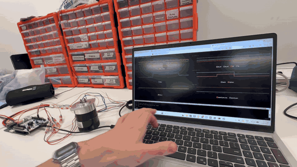
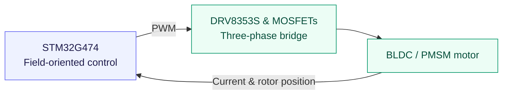
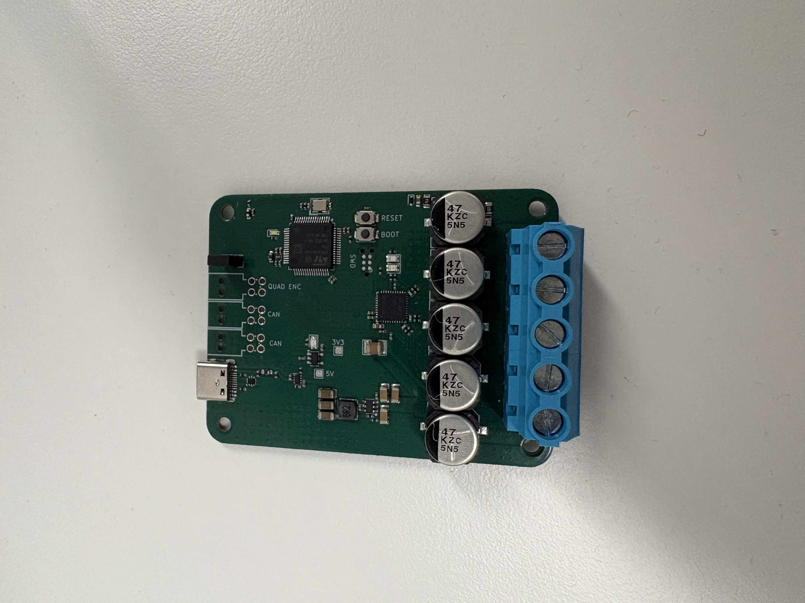
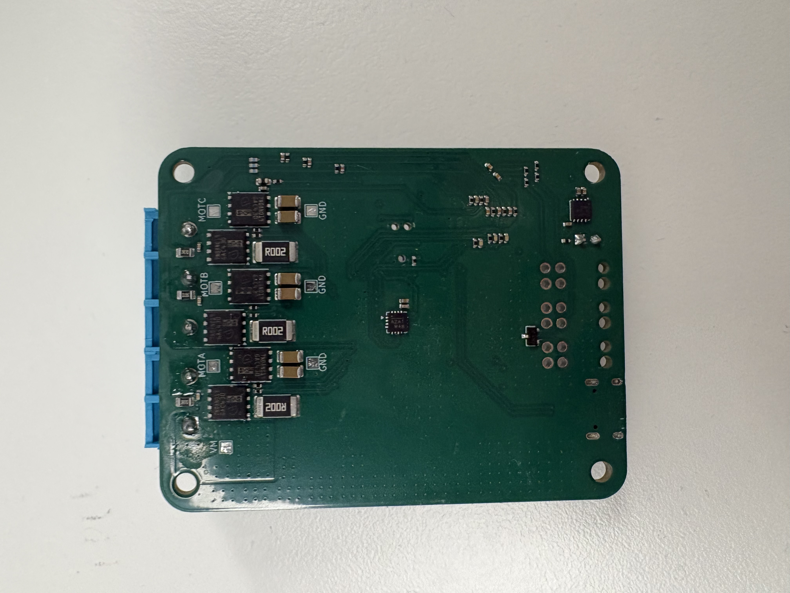
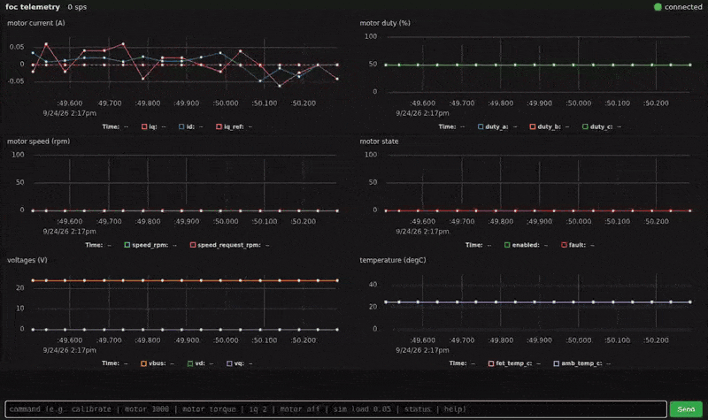

<div align="center">

# STM32 Brushless Motor Controller

A custom four-layer motor controller with bare-metal field-oriented control on an STM32G474. The project includes the PCB design, C firmware, a motor simulator and a live control dashboard.



*Real motor bench test with the live telemetry dashboard.*

</div>

## Engineering overview

- **Hardware:** a 57 × 75 mm PCB with six MOSFETs, three low-side current shunts, absolute encoder feedback and CAN connectivity.
- **Control:** 20 kHz d/q current loops and SVPWM, a 2 kHz speed loop, decoupling feedforward and field weakening.
- **Firmware:** bare-metal C using CMSIS headers, with register-level peripheral drivers and no STM32 HAL dependency. The application code also runs in the software-in-the-loop simulator.
- **Calibration and protection:** current-sense polarity and encoder calibration, stored settings, and checks for current, voltage, temperature, encoder and communication faults.
- **Tools:** a browser dashboard for commands and telemetry, plus unit tests and simulated motor/fault scenarios.


```mermaid
flowchart LR
    control["STM32G474<br/>Field-oriented control"]
    power["DRV8353S & MOSFETs<br/>Three-phase bridge"]
    motor["BLDC / PMSM motor"]
    control -->|PWM| power --> motor
    motor -->|Current & rotor position| control

    classDef controller fill:#eef2ff,stroke:#6366f1,color:#1e1b4b
    classDef drive fill:#ecfdf5,stroke:#059669,color:#064e3b
    class control controller
    class power,motor drive
```

## Hardware

<p align="center">
  
  
</p>

| Item | Design |
| --- | --- |
| MCU | STM32G474RET6, 170 MHz |
| Gate driver | TI DRV8353S, configured over SPI |
| Input range | 12–60 V design target |
| Phase current | 25 A continuous design target; firmware defaults to a 20 A limit |
| MOSFETs | Six IAUCN08S7N019ATMA1, 80 V |
| Current sensing | Three 2 mΩ shunts with Kelvin connections |
| Position feedback | MA730 SPI encoder; external quadrature interface |
| PWM | HRTIM, 20 kHz, 200 ns dead time |
| Interfaces | CAN, USB CDC, UART and SWD |
| PCB | 57 × 75 mm, four layers |

The layout keeps gate-drive loops short, separates current-sense connections from power routing, and uses copper pours and via arrays to distribute current and heat. KiCad sources and manufacturing files are in [`controller_hardware/`](controller_hardware/).

## Live dashboard

<p align="center">
  
</p>

The dashboard connects to either the simulator or a board over USB. It shows motor telemetry and accepts commands for speed, torque, calibration and fault handling. The GIF above shows the simulator.

## Try the simulator

On Windows, run `controller_firmware\tools\setup.bat` to install missing tools, build the simulator and run tests. Then run `controller_firmware\tools\dashboard.bat` to open the dashboard.

For a manual build, install CMake, Ninja, a host C compiler and Python:

```sh
cd controller_firmware
cmake --preset sim
cmake --build --preset sim
ctest --preset sim
python -m pip install -r tools/dashboard/requirements.txt
python tools/dashboard/plot_motor.py --sim
```

Open [localhost:8988](http://localhost:8988). In the dashboard console, run `calibrate`, then `motor 3000` to request 3,000 rpm. Use `motor off` to stop. Simulator commands such as `sim load 0.1` and `sim lock on` exercise load response and fault handling.

## Build for the board

Install STM32CubeCLT and put its Arm compiler, CMake, Ninja and STM32 programmer on PATH. From `controller_firmware/`:

```sh
cmake --preset default
cmake --build --preset default
cmake --build build --target flash
```

Flashing uses ST-Link over SWD. To connect the dashboard to the board:

```sh
python tools/dashboard/plot_motor.py --serial COM5
```

Set the motor parameters and limits in [`app/config.h`](controller_firmware/app/config.h) before running hardware. Start with a current-limited supply and an unloaded motor, then run calibration before requesting motion.

## Validation and limits

C tests cover control maths, SVPWM, configuration, commands and telemetry. Software-in-the-loop tests exercise calibration, torque and speed response, field weakening, CAN control and fault handling. CI builds the firmware and runs simulator and dashboard tests on Linux and Windows.

The electrical ratings above are design targets; simulation does not establish continuous-current capability or thermal performance. This board revision has no on-board reverse-polarity protection, fuse or bus TVS.

## Code guide

| Location | Contents |
| --- | --- |
| [`controller_hardware/`](controller_hardware/) | KiCad schematics, PCB layout and manufacturing files |
| [`controller_firmware/app/`](controller_firmware/app/) | FOC, control loops, calibration, commands and telemetry |
| [`controller_firmware/hal/stm32g474/`](controller_firmware/hal/stm32g474/) | HRTIM, ADC, encoder, gate-driver, CAN and USB drivers |
| [`controller_firmware/sim/`](controller_firmware/sim/) | Simulated hardware interface, motor model and TCP server |
| [`controller_firmware/tests/`](controller_firmware/tests/) | Unit and motor simulation tests |
| [`controller_firmware/tools/dashboard/`](controller_firmware/tools/dashboard/) | Browser dashboard and Python bridge |

MIT licensed. Copyright © 2026 James Goss.
